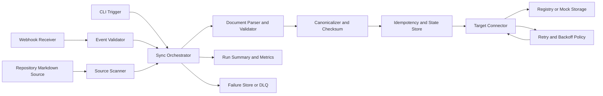

# Architecture Specification: Automated Documentation Sync

## 1. Architecture Goals
- Implement a phase-1 pipeline that syncs Markdown documents from repository files to a registry/mock storage target.
- Support two trigger paths: CLI and webhook/event-driven.
- Preserve YAML frontmatter metadata and Markdown body.
- Ensure idempotency, graceful error handling, and rate-limit backoff.

## 2. Scope and Constraints
- In scope: Markdown (.md) source files, YAML frontmatter parsing, deterministic upsert to target.
- In scope: run summary, structured logging, retry with exponential backoff + jitter.
- Out of scope: bi-directional sync, rich-format conversion, manual approval workflow.

## 3. High-Level Architecture

## 4. Component Design

### 4.1 Trigger Layer
- CLI Trigger:
  - Entry point for full sync and path-scoped sync.
  - Produces a run context with run_id, trigger_type=cli, and optional scope filters.
- Webhook Receiver:
  - Receives repository events.
  - Validates payload schema and signature.
  - Extracts changed file scope and creates run context with trigger_type=event.

### 4.2 Source Scanner
- Resolves include/exclude path patterns.
- Selects only .md files.
- Produces source document manifests:
  - repository_id
  - source_path
  - file_size
  - discovered_at

### 4.3 Parser and Validator
- Splits frontmatter and Markdown body.
- Parses YAML frontmatter.
- Applies metadata schema validation.
- Emits either:
  - Valid canonical input object, or
  - Structured validation error.

### 4.4 Canonicalizer and Checksum
- Normalizes source_path separators and line endings.
- Produces deterministic document key:
  - key = hash(repository_id + normalized_source_path)
- Produces checksum from normalized body + selected metadata.

### 4.5 Idempotency and State Store
- Stores last successful checksum by document key.
- Decision rules:
  - New key: create.
  - Existing key + changed checksum: update.
  - Existing key + unchanged checksum: skip (no-change).
- Stores processed event identifiers to suppress duplicate event writes.

### 4.6 Target Connector
- Provides abstract operations:
  - get(key)
  - upsert(key, document)
  - delete_or_mark_inactive(key) (policy-driven)
- In phase 1, implementation points to mock storage; interface remains production-ready.

### 4.7 Reliability Subsystems
- Retry/Backoff Engine:
  - Handles transient failures and throttling.
  - Uses exponential backoff with jitter.
- Failure Store/DLQ:
  - Captures unrecoverable failures with context:
    - run_id
    - source_path
    - key
    - error_class
    - error_message

### 4.8 Observability Layer
- Structured logs per stage and document.
- Run metrics:
  - discovered_count
  - processed_count
  - succeeded_count
  - skipped_count
  - failed_count
  - retry_count
  - duration_ms
- Final run summary emitted to CLI output and log sink.

## 5. Runtime Flows

### 5.1 CLI Flow
1. User executes sync command.
2. Orchestrator builds run context.
3. Scanner discovers markdown files.
4. Each document is parsed, validated, canonicalized, and checksummed.
5. Idempotency layer decides create/update/skip.
6. Target connector writes with retry policy.
7. Summary and exit code are returned.

### 5.2 Webhook/Event Flow
1. Webhook endpoint receives event.
2. Signature and payload are validated.
3. Relevant markdown paths are extracted.
4. Orchestrator processes only affected files.
5. Duplicate event IDs are de-duplicated.
6. Writes occur through idempotency + retry path.
7. Summary is emitted for observability.

## 6. Data Contracts

### 6.1 Canonical Document Contract
- key: string
- repository_id: string
- source_path: string
- metadata: object
- content_markdown: string
- checksum: string
- version: string
- last_synced_at: timestamp

### 6.2 Minimum Metadata Contract (YAML Frontmatter)
- title: string
- source_path: string
- version: string
- last_updated: string (ISO-8601 date or datetime)
- doc_id: optional if deterministic keying is enabled

## 7. Error Handling Strategy
- Validation errors:
  - Mark document failed; continue run.
- Missing file errors:
  - Mark file-not-found; continue run.
- Target transient errors:
  - Retry with backoff and jitter.
- Retry exhaustion:
  - Mark failed with retry-exhausted classification.
- Fatal startup errors (for example misconfiguration):
  - Abort run with non-zero exit code and actionable message.

## 8. Idempotency Model
- Idempotency key scope: repository_id + normalized source_path.
- Change detection: checksum comparison against last successful sync.
- Duplicate event handling: event_id ledger with TTL/configurable retention.
- Guarantee: repeated runs and duplicate events converge to one consistent target state.

## 9. Security Architecture
- Secrets loaded only from environment variables or secret manager.
- Webhook payload signature verification before processing.
- Log redaction for credentials and sensitive headers.
- Input validation for all external payloads and CLI options.

## 10. Deployment and Packaging (Phase 1)
- Runtime shape:
  - CLI executable entry point.
  - Webhook service endpoint process.
- Config via environment and config file:
  - source include/exclude patterns
  - retry/backoff settings
  - target connector mode (mock or registry)
  - webhook signature key settings

## 11. Suggested Repository Layout
- apps/sync-service/
  - triggers/
  - source/
  - parser/
  - canonical/
  - idempotency/
  - target/
  - reliability/
  - observability/
- shared/
  - contracts/
  - config/
  - logging/
  - errors/
- tests/
  - unit/
  - integration/
  - resilience/

## 12. Test Architecture
- Unit tests:
  - parser and YAML validation
  - deterministic key and checksum
  - retry policy math and jitter boundaries
- Integration tests:
  - source-to-target upsert and no-change skip behavior
  - CLI run summary and exit codes
  - webhook scoped sync
- Resilience tests:
  - throttling simulation (429)
  - transient 5xx retries
  - malformed frontmatter and missing file isolation

## 13. Requirements Traceability
- FR-1 and AC-1: Source Scanner.
- FR-2 and AC-2: Parser and Validator.
- FR-3 and AC-5: Canonicalizer + Idempotency + Target Connector.
- FR-4 and AC-3: CLI Trigger.
- FR-5 and AC-4: Webhook Receiver + Event Validator.
- FR-7 and AC-6: Error Handling Strategy.
- FR-8 and AC-7: Retry/Backoff Engine.
- NFR-1 to NFR-5: Reliability, Observability, Security, and modular component boundaries.

## 14. Open Decisions
- Exact checksum algorithm (for example SHA-256) and canonicalization rules.
- Event ledger retention duration.
- Maximum payload/file size limits.
- Concurrency level defaults for document processing.
- Delete vs mark-inactive policy for removed source files.
