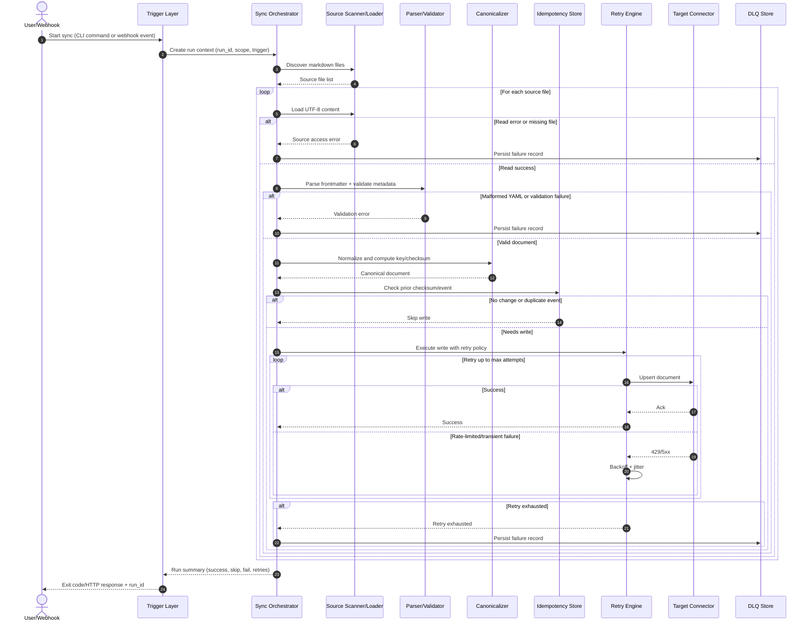

# Architecture Specification: Automated Documentation Sync

## 1. Purpose and Scope
This architecture implements the phase-1 requirements in [requirements.md](requirements.md): synchronize Markdown files with YAML frontmatter from repository storage into a target registry/mock storage, via CLI and webhook triggers, with idempotency, rate-limit handling, and graceful failure isolation.

## 2. Architecture Drivers
- Functional drivers:
  - Parse Markdown and YAML frontmatter.
  - Support full and scoped CLI sync.
  - Support webhook/event-triggered incremental sync.
  - Upsert by deterministic key with no-change skip.
- Non-functional drivers:
  - Idempotency across repeated runs and duplicate events.
  - Retry with exponential backoff and jitter.
  - Dead-letter capture for unrecoverable failures.
  - Structured logs and run metrics.

## 3. Technology Stack Choices

### 3.1 Language and Runtime
- Python 3.13 for fast iteration, strong filesystem support, and test tooling.

### 3.2 Core Libraries
- `PyYAML` for YAML frontmatter parsing.
- `pytest` for unit, integration, and resilience tests.
- Standard library modules:
  - `pathlib` for path normalization.
  - `hashlib` for deterministic checksum generation.
  - `fnmatch` for include/exclude glob filtering.
  - `json`, `logging`, `time`, and `uuid` for orchestration and observability.

### 3.3 Trigger and Service Options
- CLI trigger: Python module entrypoint under `apps/sync_service/main.py`.
- Webhook trigger: lightweight HTTP service (recommended `FastAPI` + `uvicorn`) for event validation and dispatch.

### 3.4 Storage Options
- Phase 1 target: mock storage adapter (in-memory/file-backed).
- Idempotency state store: local persistent store (file or SQLite) with document key and checksum.
- Dead-letter queue store: append-only JSONL or SQLite table with failure payload and metadata.

## 4. Component Architecture

### 4.1 Trigger Layer
- CLI Trigger:
  - Starts full or path-scoped runs.
  - Produces run context (`run_id`, scope, trigger type).
- Webhook Receiver:
  - Verifies signature and schema.
  - Extracts changed Markdown paths.
  - Deduplicates repeated events by `event_id`.

### 4.2 Orchestrator
- Coordinates end-to-end workflow for a run.
- Enforces ordering: discover -> parse -> validate -> canonicalize -> idempotency check -> write.
- Aggregates per-file and run-level outcomes.

### 4.3 Source Scanner and Loader
- Discovers `.md` files from configured source root.
- Applies include/exclude patterns.
- Loads UTF-8 content; emits source access errors for missing/unreadable files.

### 4.4 Frontmatter Parser and Validator
- Splits YAML frontmatter from Markdown body.
- Parses frontmatter into key/value mapping.
- Validates required metadata fields and types.

### 4.5 Canonicalizer and Checksum Engine
- Normalizes path separators and line endings.
- Builds deterministic document key from repository id + normalized source path.
- Computes checksum from normalized content and selected metadata.

### 4.6 Idempotency and Event Ledger
- Document ledger stores last successful checksum by key.
- Event ledger stores processed webhook event identifiers.
- Decision outcomes:
  - `create`
  - `update`
  - `no_change`
  - `failed`

### 4.7 Target Connector
- Contract-based adapter:
  - `get(key)`
  - `upsert(key, canonical_doc)`
  - `delete_or_mark_inactive(key)`
- Default phase-1 implementation points to mock storage.

### 4.8 Reliability Subsystem
- Retry Engine:
  - Classifies transient and throttling errors.
  - Applies exponential backoff with jitter.
  - Stops at configured retry limit.
- Dead-Letter Queue (DLQ):
  - Persists unrecoverable document failures.
  - Stores `run_id`, `event_id`, source path, document key, error class, retry attempts, timestamp.

### 4.9 Observability and Reporting
- Structured logs with `run_id` and `document_key`.
- Metrics: discovered, processed, succeeded, skipped, failed, retries, duration.
- CLI summary and machine-readable run report.

## 5. Sync Flow Sequence Diagram

## 6. Retry and Dead-Letter Queue Logic

### 6.1 Retry Policy
- Retry categories:
  - HTTP 429 rate-limited responses.
  - Transient target errors (for example 5xx, timeout, connection reset).
- Non-retry categories:
  - Malformed YAML and metadata validation errors.
  - Permanent request errors caused by invalid payload shape.
- Backoff formula:
  - `delay = min(max_delay_ms, base_delay_ms * 2^(attempt-1)) + jitter`
- Default policy:
  - max attempts: 5
  - base delay: 200 ms
  - max delay: 5000 ms

### 6.2 DLQ Record Contract
- `run_id`
- `trigger_type`
- `event_id` (if webhook)
- `source_path`
- `document_key` (if computed)
- `error_class`
- `error_code`
- `error_message`
- `attempt_count`
- `failed_at`

### 6.3 DLQ Processing
- Persist one record per unrecoverable file-level failure.
- Do not block remaining files in the same run.
- Surface DLQ count in run summary.
- Support replay workflow in later phase (out of scope for phase 1 implementation).

## 7. Data Contracts

### 7.1 Canonical Document
- `key`: string
- `repository_id`: string
- `source_path`: string
- `metadata`: object
- `content_markdown`: string
- `checksum`: string
- `version`: string

### 7.2 Required Frontmatter Fields
- `title`
- `source_path`
- `version`
- `last_updated` (ISO-8601 date or datetime)
- `doc_id` optional when deterministic keying is enabled

## 8. Security and Compliance Controls
- Secrets and tokens loaded from environment or secret manager only.
- Webhook signature verification before orchestration.
- Input and schema validation for all external trigger payloads.
- Structured logging with secret redaction.

## 9. Deployment View (Phase 1)
- One CLI process for ad hoc runs.
- One webhook service process for event-triggered runs.
- Shared config via environment variables.
- Mock target adapter as default, with pluggable interface for production registry.

## 10. Traceability to Requirements
- FR-1 and AC-1: Source scanner and glob filtering.
- FR-2 and AC-2: Frontmatter parser and metadata validator.
- FR-3 and AC-5: Canonical key/checksum and idempotent upsert.
- FR-4 and AC-3: CLI trigger and exit status handling.
- FR-5 and AC-4: Webhook validation and event dedup ledger.
- FR-7 and AC-6: Graceful file-level failure isolation and reporting.
- FR-8 and AC-7: Retry engine, backoff policy, and DLQ persistence.
- NFR-1 to NFR-5: Reliability, performance guardrails, observability, security, and modular maintainability.

## 11. Open Design Decisions
- Final webhook framework choice (FastAPI recommended).
- Choice of persistent stores for idempotency ledger and DLQ in non-mock environments.
- Delete versus mark-inactive policy for source document removals.
- Concurrency default for parallel file processing under rate-limit constraints.
